> [!NOTE]
> This repo is an extension mod for [Town of Us: Mira](https://github.com/AU-Avengers/TOU-Mira) that adds new roles and modifiers.\
> This mod requires Town of Us: Mira to be installed and is NOT for console versions of Among Us.

  <a href="https://github.com/DivaniNL/TownOfUsMiraDivaniModsAddOn/wiki">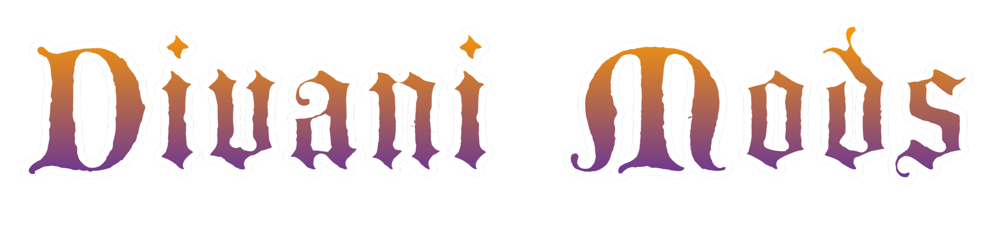</a>
  
Divani Mods

 

An [Among Us](https://store.steampowered.com/app/945360/Among_Us/) mod that adds
new roles and modifiers on top of [Town Of Us &ndash; Mira](https://github.com/AU-Avengers/TOU-Mira).

  
  <a href="https://github.com/DivaniNL/TownOfUsMiraDivaniModsAddOn/wiki/Home#thief">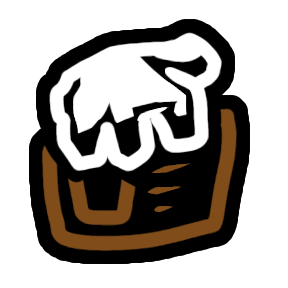</a>
  
  
  <a href="https://github.com/DivaniNL/TownOfUsMiraDivaniModsAddOn/wiki/Home#sentinel">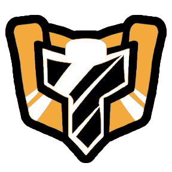</a>
  
  <a href="https://github.com/DivaniNL/TownOfUsMiraDivaniModsAddOn/wiki/Home#deadlock">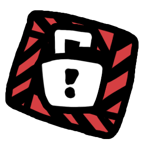</a>
  
  
  <a href="https://github.com/DivaniNL/TownOfUsMiraDivaniModsAddOn/wiki/Home#frag">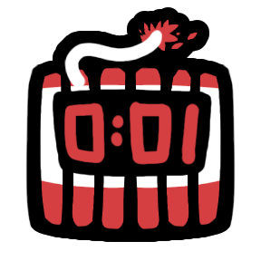</a>
  <a href="https://github.com/DivaniNL/TownOfUsMiraDivaniModsAddOn/wiki/Home#silencer">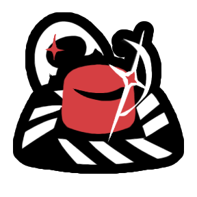</a>
  
  <a href="https://github.com/DivaniNL/TownOfUsMiraDivaniModsAddOn/wiki/Home#plague-doctor">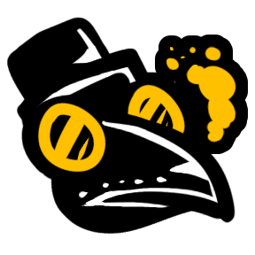</a>
  
  <a href="https://github.com/DivaniNL/TownOfUsMiraDivaniModsAddOn/wiki/Home#innocent">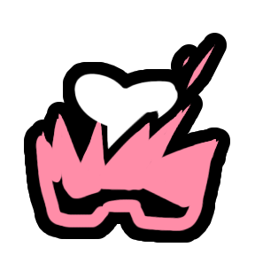</a>
  
  <a href="https://github.com/DivaniNL/TownOfUsMiraDivaniModsAddOn/wiki/Home#opportunist">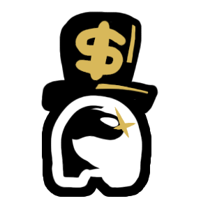</a>
  
  <a href="https://github.com/DivaniNL/TownOfUsMiraDivaniModsAddOn/wiki/Home#blindspot">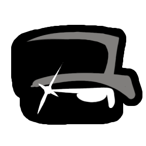</a>
  
  
  
  <a href="https://github.com/DivaniNL/TownOfUsMiraDivaniModsAddOn/wiki/Home#ruthless">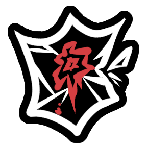</a>
  
  <a href="https://github.com/DivaniNL/TownOfUsMiraDivaniModsAddOn/wiki/Home#sniper">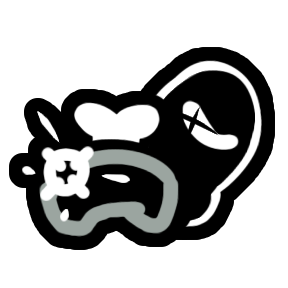</a>
  
  <a href="https://github.com/DivaniNL/TownOfUsMiraDivaniModsAddOn/wiki/Home#fragile">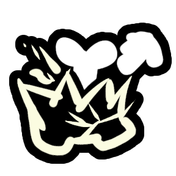</a>
  
  <a href="https://github.com/DivaniNL/TownOfUsMiraDivaniModsAddOn/wiki/Home#misvote">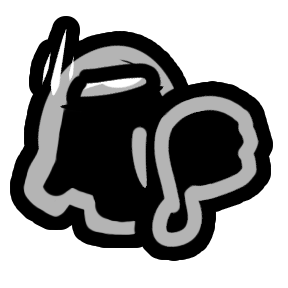</a>

---

## Installation

1. Install the mod using the same setup process as Town Of Us Mira.
2. Once Town Of Us Mira is installed, place `DivaniMods.dll` into the `[MODFOLDER]/BepInEx/plugins/` folder.
3. Launch Among Us. All Divani Mods options will appear under the **Divani Mods** tab in the lobby options.

For the simplest install, make sure your Town Of Us Mira installation is working first, then add `DivaniMods.dll` to the plugins folder.

Full role and modifier write-ups live on the **[project wiki](https://github.com/DivaniNL/TownOfUsMiraDivaniModsAddOn/wiki)**.

---

# Releases

**Disclaimer: The mod is *not* guaranteed to work on the latest versions of Among Us when the game updates.**

| Game Version      | Mod Version | Town Of Us: Mira | Download link |
| ----------------- | ----------- | ---------------- | ------------- |
| 17.3 (2026.3.31)  | 1.1.1       | 1.6.0+           | [v1.1.1](https://github.com/DivaniNL/TownOfUsMiraDivaniModsAddOn/releases/tag/v1.1.1) |
| 17.3 (2026.3.31)  | 1.1.0       | 1.6.0+           | [v1.1.0](https://github.com/DivaniNL/TownOfUsMiraDivaniModsAddOn/releases/tag/v1.1.0) |
| Steam             | 1.0.2       | —                | [v1.0.2](https://github.com/DivaniNL/TownOfUsMiraDivaniModsAddOn/releases/tag/v1.0.2) |
| Steam             | 1.0.1       | —                | [v1.0.1](https://github.com/DivaniNL/TownOfUsMiraDivaniModsAddOn/releases/tag/v1.0.1) |
| Steam             | 1.0.0       | —                | [v1.0.0](https://github.com/DivaniNL/TownOfUsMiraDivaniModsAddOn/releases/tag/v1.0.0) |

---

# Contributions & Credits

[MiraAPI](https://github.com/All-Of-Us-Mods/MiraAPI) — Mod framework and API\
[Town Of Us: Mira](https://github.com/AU-Avengers/TOU-Mira) — Base mod, inspiration, and shared assets\
[Reactor](https://github.com/NuclearPowered/Reactor) — Networking and build dependency\
[BepInEx](https://github.com/BepInEx/BepInEx) — IL2CPP plugin loader and Harmony hooks

## Asset credits

- Thank you to [@AtonyGit](https://github.com/AtonyGit) for making most role icons based of [Town Of Us: Mira](https://github.com/AU-Avengers/TOU-Mira).
- Glass&ndash;break SFX from [Freesound](https://freesound.org/) (community).

# Source inspiration

Some Divani roles and modifiers take design cues from other Among Us mod communities. These pages were useful references:

- **Opportunist** — [TOHE: Collector](https://tohe.weareten.ca/options/Neutrals/Chaos/Collector.html) (vote-collection win pattern)
- **Innocent** — [TOHE: Innocent](https://tohe.weareten.ca/options/Neutrals/Evil/Innocent.html)
- **Plague Doctor** — [TheOtherRoles GMIA wiki — Neutral roles](https://github.com/GMIA-Nexus/TheOtherRolesGMIA/wiki/Neutral-Roles#plague-doctor)
- **Bear Trap** (modifier) — [TOHE: Beartrap](https://tohe.weareten.ca/options/Addons/Helpful/Beartrap.html)
